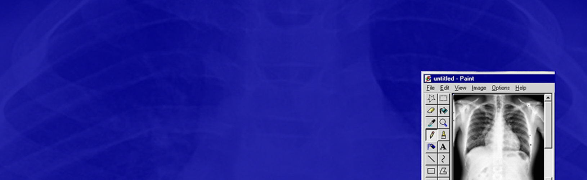
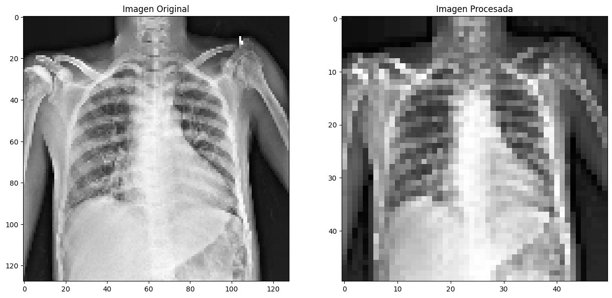

# Predicción de Cardiomegalia usando Machine Learning🫀
Este proyecto se centra en el desarrollo de un modelo de machine learning capaz de predecir la presencia de cardiomegalia en radiografías de tórax. La cardiomegalia, que se caracteriza por un agrandamiento anormal del corazón, puede ser indicativa de varias condiciones médicas serias.

*Este modelo no solo tiene el potencial de predecir la presencia de cardiomegalia en radiografías de tórax, sino que también puede ser adaptado para detectar otras condiciones médicas importantes. Por ejemplo, podría aplicarse para identificar signos de neumonía, tuberculosis, cáncer pulmonar u otras anomalías estructurales y patológicas. Al ampliar su aplicación a diversas enfermedades, este modelo puede llegar a facilitar la detección temprana y el tratamiento oportuno, contribuyendo así a mejorar los resultados clínicos y la calidad de vida de los pacientes.*

## Estructura del Proyecto
El proyecto está organizado en las siguientes carpetas:

  • **app:** Despliegue del modelo en Streamlit

    ▸ app.py: código para la aplicación web
    ▸ requirements.txt: dependencias para la aplicación
  
  • **data:** Contiene las radiografías en formato PNG, divididas en las siguientes subcarpetas
  
    ▸ train: Datos de entrenamiento.
        ⟡false: Radiografías sin cardiomegalia.
        ⟡true: Radiografías con cardiomegalia.
    ▸ test: Datos de prueba.
        ⟡false: Radiografías sin cardiomegalia.
        ⟡true: Radiografías con cardiomegalia.
  
  • **docs:** Presentaciones (técnica y de negocio) en formato PDF.
    
  • **models:** Almacena los modelos entrenados durante el proceso, incluyendo el modelo final seleccionado, en formato pkl.
  
  • **notebooks:** Contiene los Jupyter Notebooks utilizados en el proyecto:
  
    ▸ 01_Fuentes: adquisición de datos
    ▸ 02_Limpieza: transformaciones y limpiezas, análisis exploratorio
    ▸ 03_Entrenamiento_Evaluacion: entrenamiento de modelos y su evaluación con métricas

  • **src:** Código fuente en Python
  
    ▸ data_processing: código para procesar los datos
    ▸ training: código para entrenar y guardar el modelo
    ▸ evaluation: código para evaluar modelo

## Limpieza

Las imágenes fueron procesadas para entrenar el modelo, aquí un ejemplo de la transformación.
Más detalles en el archivo **02_Limpieza** en la carpeta **notebooks** . 

## Resultados 

  • **Accuracy:** 0.78

  • **Recall:** 0.73
  
  • **Precision:** 0.8
  
  • **AUC-ROC Score:** 0.87
  
  

